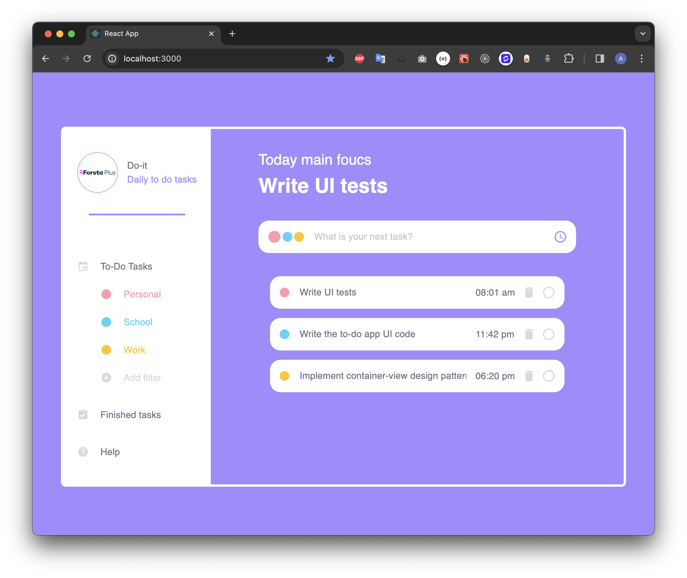
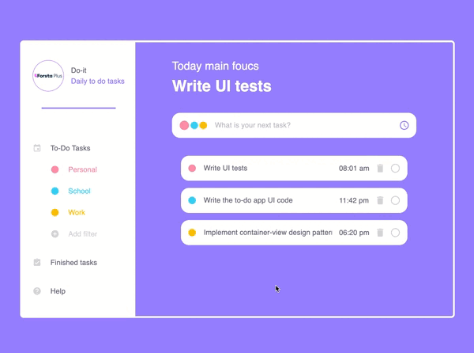

# Todo List Application



## Quick START

Open the application folder within a terminal and navigate to the `server` folder. Then run the following commands. These commands will install the required dependecies by npm and starts the backend of the app. 
```bash
yarn
yarn start
```

on another terminal window or tab navigate to the folder of the application and type the following commands to get the frontend of the app up and running. 
```bash
yarn
yarn start
```

## Application functionality




## SPECIFICATIONS

- Created with: 
  - Node.js + Express on the backend side. 
  - Typescript + React on the frontend side. 

- The user can add daily todo tasks 
- The user can also toggle tasks as "done" vs. "not done".
- The user can choose a specific category for the tasks.

## TESTS

- All functionality is tested with the [React testing library](https://testing-library.com/).
